## How to be a block producer

1.On the home page of [Block Producers], click [My Producer], as shown below.

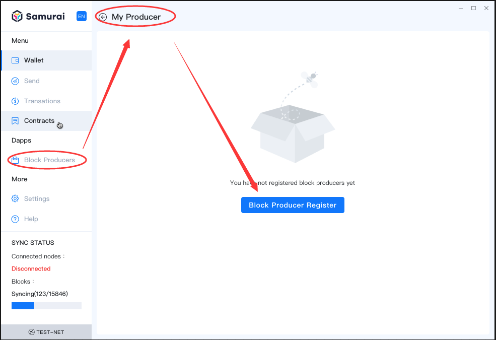

2.Click [Block Producer Register], the client navigates to [Block Producer Register], set the [Account Name], input [Node Info], and set [Incentive Plan], input [Institution Info], click [Next], as shown below:

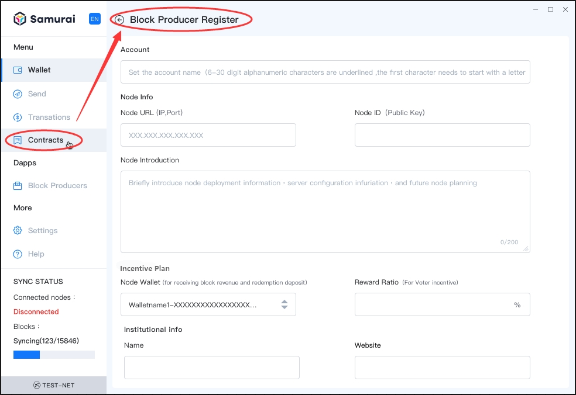

**Note:** 

*want to know how to get the the Node address(IP, port) and node ID(Public Key), please click [here](/en-us/basics/[English]-Private-Networks)* .

3.Stake:Select [Payment Wallet], input [Stake Amount], click [Submit], as shown below:

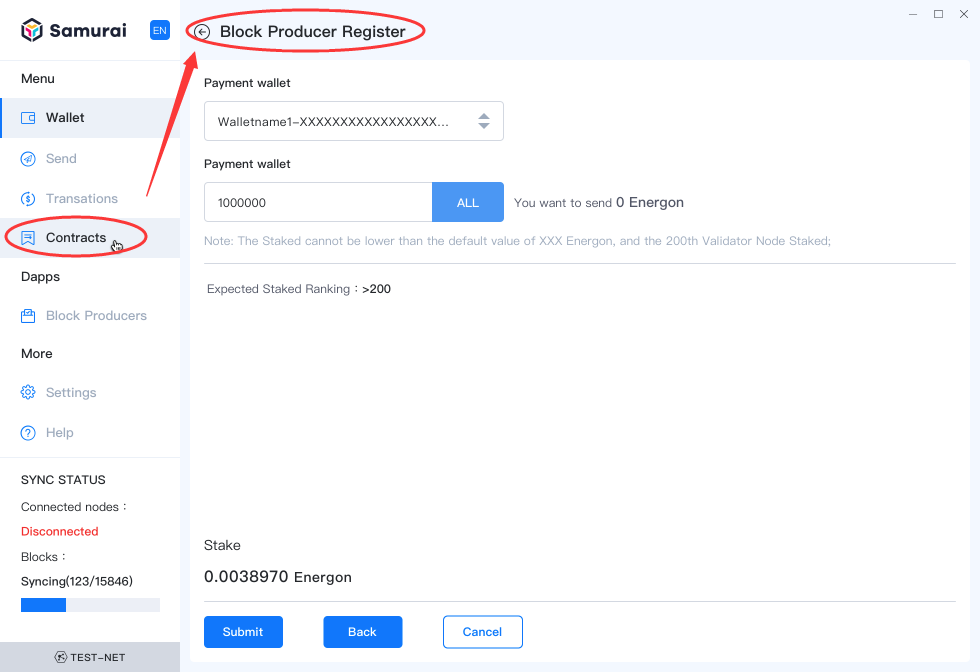

**Note : Stake Amount**

*Assume the current blcok producers are sorted by stake amounts, if the number of queuing block producers exceeds 200, and X is the 200th block producer’s stake amount. The newly inputted stake amount should be greater than 110% of X, otherwise it will not get accepted. In case the number of queuing block producers is less than 200, then the stake amount must be greater than defined default amounts .* 

4.The confirmation dialogue box pops up, please input the Payment wallet’s [Wallet Password], click [Submit], as show below:

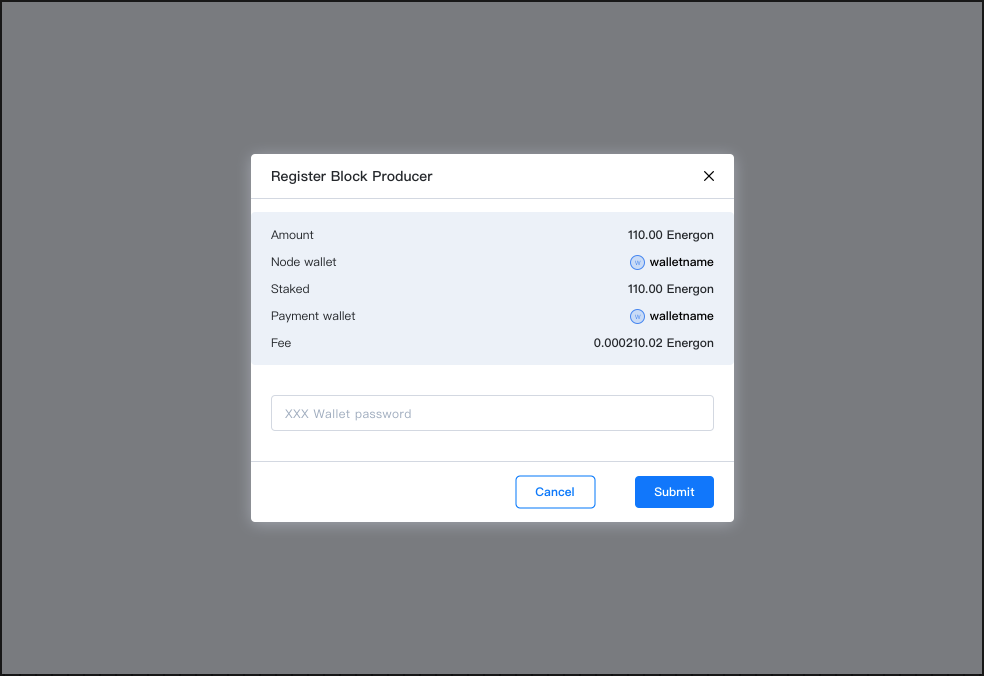

5.The registering may take a few minutes to complete, as shown below:

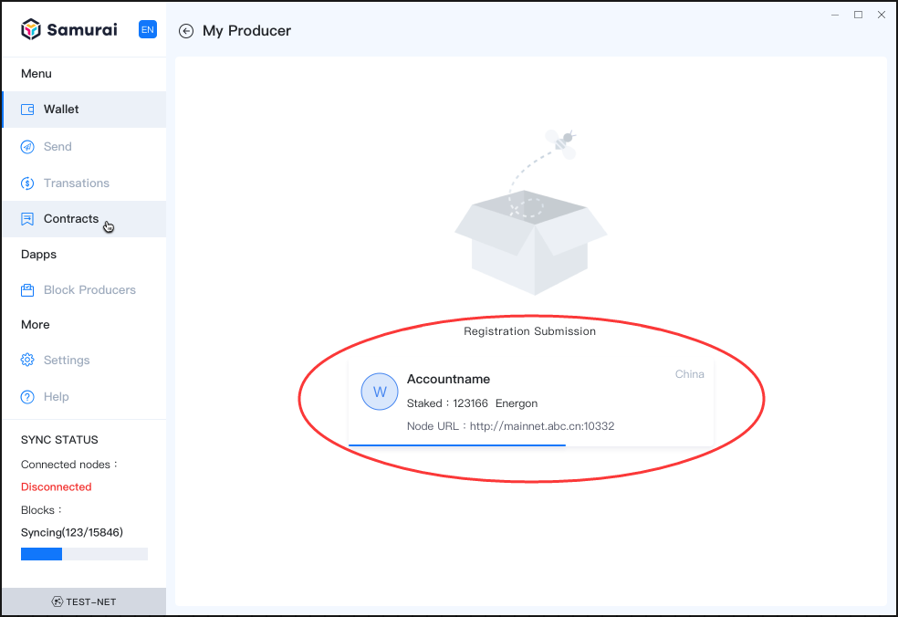

6.Once completed, the client navigates to [My Producer] page, as shown below:

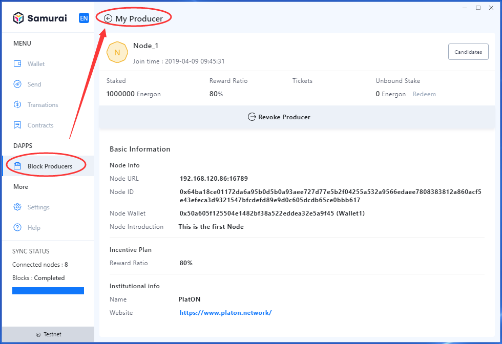

## How to improve the probability of becoming a validator

According to Platon's consensus mechanism, the node becomes the consensus candidate node by staking assets, and the node with staked assets ranking top 100 and the number of votes satisfying 512 votes will enter the nominees pool and have the opportunity to become the validator.

PlatON randomly select 25 nodes from the nominees pools as validator per round (250 blocks). The greater the sum of the node staked plus the obtained tickets staked, the higher the probability weight of being selected as the verification node.

Therefore, the more assets and votes staked, the more probability of becoming a  validator.

## How to vote for a block producer
To participate in the block producers voting,  you will have the opportunity to receive Voting Reward. For more information please click [here](/en-us/technologies/[English]-Probability-POS)

1.On the home page of [Block Producers], select the vote object, click the icon of [vote], as shown below:

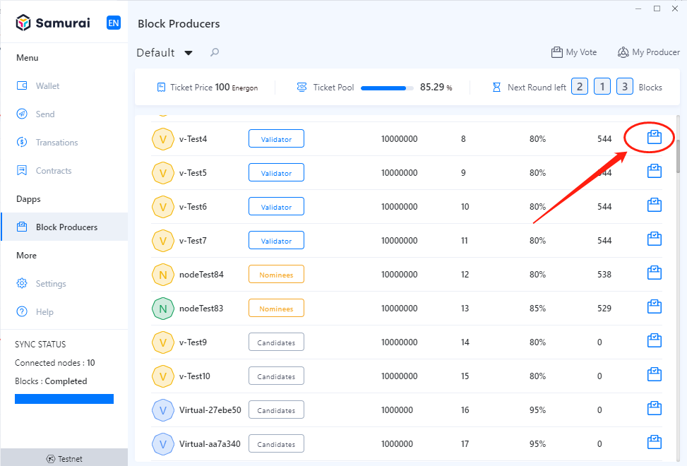

2.The client switch to [Vote] page,  Select [Voting wallet], and set the amount of [Tickets], click [Submit], as shown below:

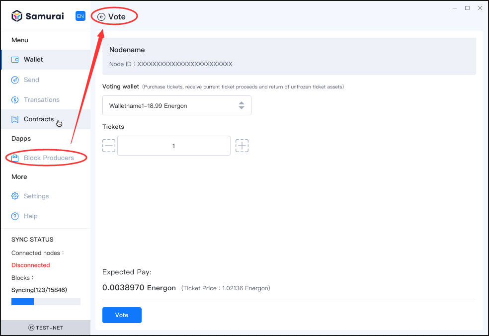

3.In the dialogue box of confirmation that pops up, input  [Wallet Password], click [Submit], as shown below:

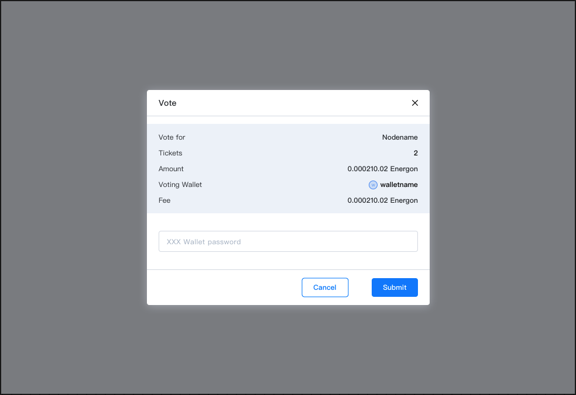

4.Review my vote, on the home page of [Block Producers], click [My Vote], to review the voting records, as shown below:

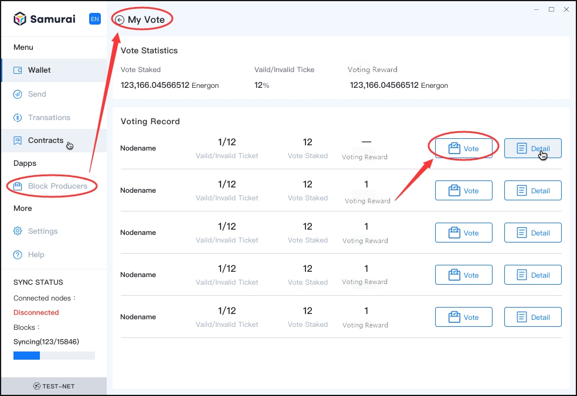

Of course, you can continue to increase voting for the nodes that have already voted, click [Vote], and the page will switch to the [Vote] page. The operation steps are the same as [Vote], and will not be described again.

**Note : Voting rules**

- *Stake the corresponding Energon based on the fare and the number of votes purchased.*
- *Ticket withdrawing is forbidden during the validity period.*
- *One ticket voted for one Node.*
- *Ticket life cycle: 1,536,000 blocks.*
- *The Tickets would expire if have not been selected during the voting period, and be released from the ticket pool and unlock the locked assets to the voting wallet.*
- *If the block producers that have been voted for are eliminated, the node's votes will be released and unlock the locked assets to the voting wallet.*
- *The selected witness ticket, will unlock the assets locked by the ticket to the voting wallet after being released from voting pool.*
- *The selected witness ticket, will receive the voting reward according to reward ratio set by the consensus node.*

## Why are block producers eliminated

The block producers includes up to 100 nodes in the nominees pool and up to 100 nodes in the candidates pool. The node with staked assets ranking top 100 and the number of votes satisfying 512 votes will enter the nominee pool, and the others enter the candidate pool.

The nodes in the pool are ranked according to the node staked plus the total number of tickets staked obtained. The candidate pool nodes beyond 100 will be eliminated, the node staked will be unlocked, and the voting tickets associated will be released as well.

## How to re-register for block producer if eliminated

One the page of [My Producer], click [Rejoin], the client will return to the process of registering for block producer, you can click [How to be a block producer](#How-to-be-a-block-producer) to view the operation process.

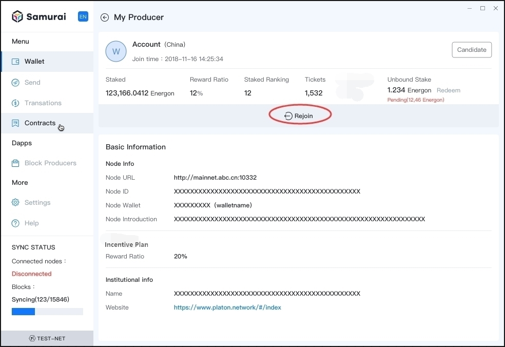

## How to revoke the block producer
1.On the page of [My Producer], click [Revoke Producer], as shown below:

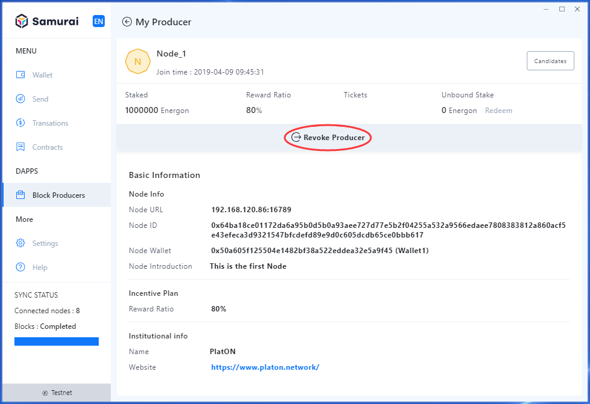

2.The dialogue box of confirmation pops up, input the node’s [Wallet password], click [Submit], as shown below:

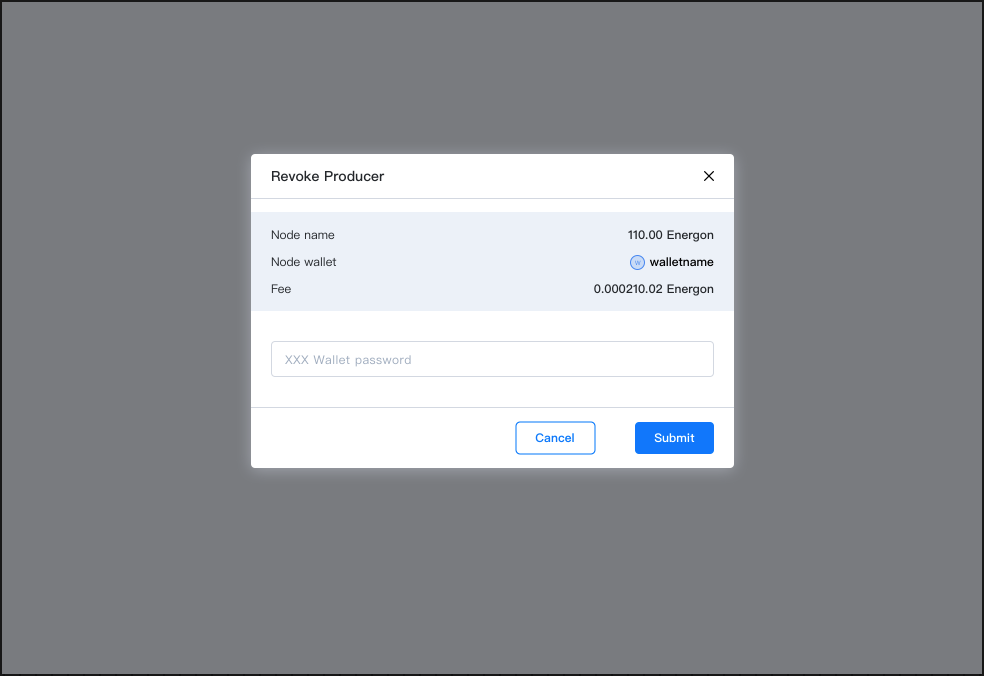

3.After submitting, on the page of [My Producer], the result of revoking producer will be displayed, as shown below:

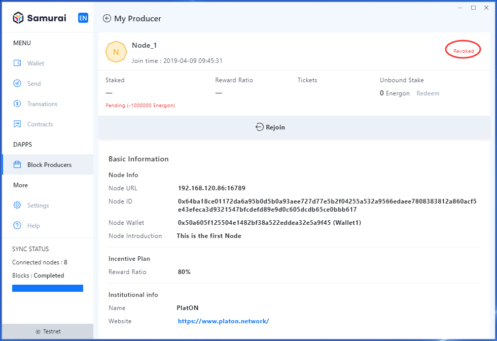

## How to redeem the stakes

Node being eliminated, or revoking producer, for any of these reasons, you can apply for redeeming the stake, the steps are as below.

1.On the page of [My Producer], click [Redeem], as shown below:

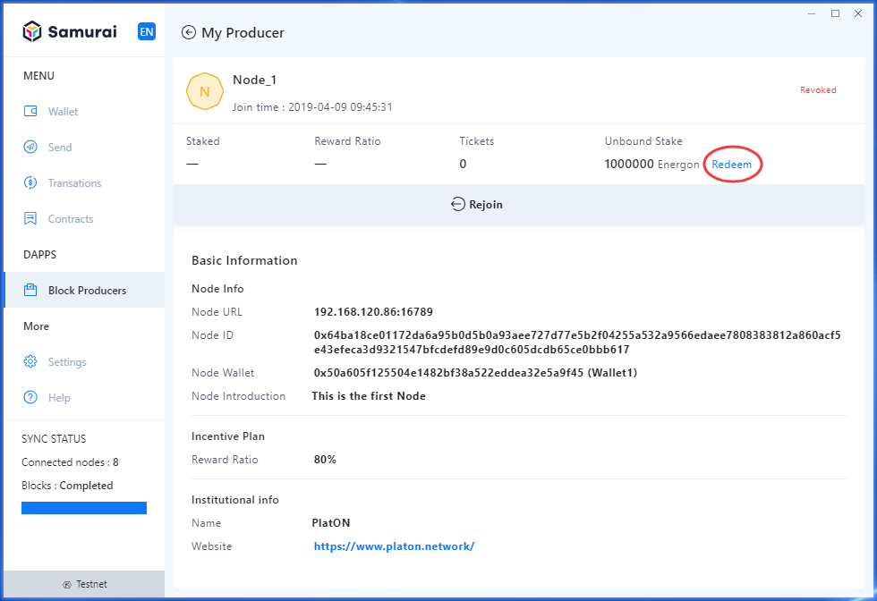

2.The dialogue box of confirmation pops up, and input the node’s [Wallet password], click [Submit], as shown below:

**Note : Stake redemption**

*The released stakes need to be redeemed proactively, for they won’t return to the payment wallet automatically.*

*Before rejoin with a node that has been revoked, please ensure that the unbound staked has been fully extracted, otherwise the registration will fail.*

